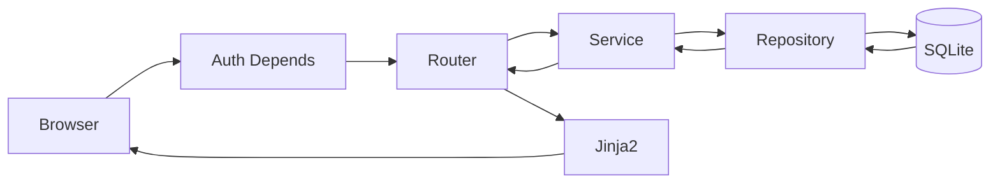
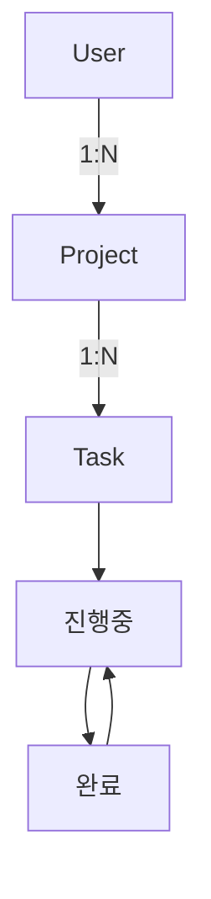

# B5-3 Round 01 — Beginner Guide

구분: **선택 미션 (OPTIONAL)**  
현재 모드: **Phase A — REFERENCE BUILD**

> 지금은 기준 구현과 학습·검증 경로를 준비합니다. 실제 로그인/브라우저/DB 확인은 Phase C에서 한 단계씩 수행합니다.

## 00. 미션 한눈에 보기

B5-3은 B5-2의 단일 CRUD를 다음 단계로 확장합니다.

```text
CRUD
→ 로그인/로그아웃
→ 비로그인 접근 차단
→ User-Project-Task 관계
→ Task 상태 변경
→ 관계/상태를 화면에서 확인
```

## 01. Reference 서비스

**프로젝트 할 일 관리 서비스**를 사용합니다.

- User 1:N Project
- Project 1:N Task
- Task: 진행중 ↔ 완료
- 세션 기반 인증

## 02. 전체 구조



비로그인 사용자는 Auth Depends에서 차단됩니다. 로그인한 사용자는 Router→Service→Repository를 거쳐 관계형 DB를 사용하고 결과는 Jinja2 화면으로 돌아옵니다.

## 03. 꼭 알아야 할 용어

### 인증 (Authentication)
"누구인가"를 확인합니다. B5-3에서는 로그인 세션으로 확인합니다.

### 인가 (Authorization)
"이 기능에 접근해도 되는가"를 결정합니다. 이 미션은 복잡한 역할이 아니라 로그인/비로그인 구분만 요구합니다.

### 세션 (Session)
로그인 상태를 여러 HTTP 요청 사이에서 이어주는 정보입니다. Reference는 세션 쿠키를 사용합니다.

### `Depends`
FastAPI 의존성 주입입니다. 보호 Router가 실행되기 전에 `require_username`이 로그인 여부를 검사합니다.

### 1:N 관계
하나의 부모가 여러 자식을 갖는 관계입니다. User→Project, Project→Task가 해당합니다.

### `back_populates`
SQLAlchemy에서 양쪽 ORM 객체가 서로의 관계를 탐색하도록 연결합니다.

### Cascade
부모가 제거될 때 자식 데이터를 어떻게 처리할지 정하는 정책입니다. Reference는 orphan 데이터를 남기지 않도록 `all, delete-orphan`을 선택했습니다.

## 04. 인증 방식

공식 방식 A인 **세션 기반 인증**을 선택했습니다.

```text
POST /login
→ 계정 확인
→ request.session['username'] 저장
→ 보호 URL 요청
→ Depends(require_username)
→ session 확인
→ 통과 또는 /login 이동
```

테스트 계정은 공식 README 공개 요구에 맞춘 로컬 학습용 `demo / demo1234`입니다.

`SESSION_SECRET` 실제 값은 저장소에 넣지 않고 로컬 환경 변수로만 사용합니다.

## 05. 공개 / 보호 경로

공개: `/`, `/login`  
보호: `/app/projects`, `/app/projects/new`, `/app/projects/{id}`, Task 생성/상태변경 경로

상세 정책은 `reference/README.md`의 표를 사용합니다.

## 06. 관계와 상태 변경



Project 화면에서 owner와 Task 목록을 함께 출력하므로 관계 데이터를 화면에서 직접 확인할 수 있습니다. Task 상태 전환 규칙은 `ProjectService.toggle_task()`에 둡니다.

## 07. Phase C 전체 실행 순서

1. Python/저장소 상태 확인
2. 가상환경 생성
3. 의존성 설치
4. `SESSION_SECRET` 로컬 설정
5. 서버 기동
6. 비로그인 홈 확인
7. 보호 URL 직접 접근 차단 확인
8. 로그인 실패 확인
9. 정상 로그인
10. 로그인 후 UI 변화
11. Project 생성
12. Task 생성
13. 관계 데이터 확인
14. Task 상태 변경 전/후 확인
15. 로그아웃
16. 보호 URL 재차단
17. SQLite 직접 확인
18. Evidence/평가 설명

## 08. Runtime Step 공통 형식

Phase C의 각 단계는 반드시 다음 형식으로 진행합니다.

1. ① 왜 하는가
2. ② 무엇을 하는가
3. ③ 이번 단계에서 알아야 할 용어
4. ④ 필요한 핵심 개념
5. ⑤ 실행할 명령어 또는 코드
6. ⑥ 명령어와 코드에 입문자가 이해할 수 있는 주석
7. ⑦ 예상되는 정상 결과
8. ⑧ 그 결과가 의미하는 것
9. ⑨ 자주 발생하는 오류와 해결 방법
10. ⑩ 완료 확인

## 09. 환경 준비 — Phase C

```bash
cd training/round-01-clear/reference
python3 --version
python3 -m venv .venv
source .venv/bin/activate
python -m pip install -r requirements.txt
export SESSION_SECRET='로컬에서만 사용할 임의값'
uvicorn app.main:app --reload
```

실제 `SESSION_SECRET`은 채팅/Git/Evidence에 복사하지 않습니다.

## 10. 인증 검증 — Phase C

### 비로그인 보호 URL
브라우저 주소창에 `/app/projects`를 직접 입력해도 로그인 화면으로 이동해야 합니다.

### 로그인 실패
틀린 ID/PW를 입력했을 때 오류 문구가 보여야 합니다.

### 로그인 성공
`demo / demo1234`로 로그인 후 "demo님 환영합니다"와 로그아웃 버튼이 나타나야 합니다.

### 로그아웃
로그아웃 후 `/app/projects`를 다시 직접 열면 재차 차단되어야 합니다.

## 11. 관계 데이터 — Phase C

Project 생성 후 Project 화면에서 다음을 확인합니다.

- 프로젝트 이름
- 소유자 username
- Task 목록

DB도 `environment/inspect_db.py`로 User/Project/Task FK 연결을 확인합니다.

## 12. 상태 변경 — Phase C

Task를 등록하면 처음 상태는 `진행중`입니다. 버튼을 누르면 `완료`, 다시 누르면 `진행중`으로 바뀌어야 합니다.

이 변경은 Router가 아니라 Service의 `toggle_task()`가 담당합니다.

## 13. Reference 검증

```bash
bash environment/verify.sh
```

구조, Python syntax, 3모델, FK 2개, `back_populates`, Depends 보호, SessionMiddleware, Service 상태변경 코드를 검사합니다.

이 결과는 실제 브라우저 Runtime을 대신하지 않습니다.

## 14. 자주 발생하는 오류

### `SESSION_SECRET environment variable is required`
서버 시작 전에 로컬 셸에서 `export SESSION_SECRET=...`을 실행합니다.

### 보호 URL이 열려 버림
해당 Router 함수에 `Depends(require_username)`이 있는지 확인합니다.

### 로그인 후에도 다시 로그인으로 이동
브라우저 쿠키가 유지되는지, SessionMiddleware가 등록되었는지 확인합니다.

### relation 데이터가 비어 있음
현재 로그인 User의 owner_id와 Project/Task FK를 `inspect_db.py`로 확인합니다.

### `Template not found`
반드시 `training/round-01-clear/reference`에서 Uvicorn을 실행합니다.

## 15. Evidence

`evidence/README.md`에 실제 로그인 전/후, 보호 접근, 관계 데이터, 상태 전/후, DB 결과를 수집하는 목록을 준비했습니다.

## 16. 평가 준비

`docs/evaluation-qa.md`에서 다음을 실제 코드와 연결해 설명합니다.

- 인증/인가 Depends 흐름
- 직접 URL 접근이 차단되는 이유
- 세션 방식 선택 이유/확장성
- 1:N, back_populates
- cascade 정책
- Service 상태 변경
- REST frontend 분리 시 인증 변화

## 17. CLEAR

현재는 **Reference 핵심 기준본 준비 단계**입니다.

```text
Reference 구현
+ 실제 로그인/차단/UI
+ 관계형 DB
+ 상태 변경 전후
+ SQLite 확인
+ README 재현
+ Evidence
+ 평가 설명
= ✅ B5-3 CLEAR
```

실제 Runtime 전에는 CLEAR로 표시하지 않습니다.
